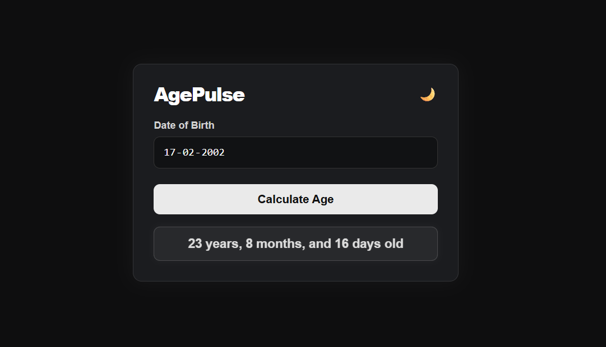
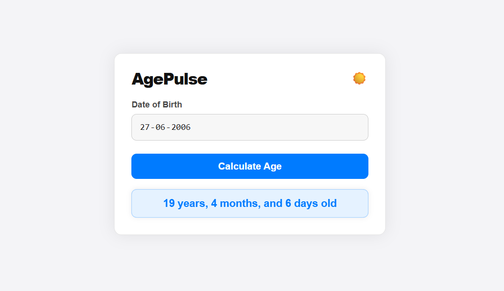

# AgePulse  (Project 14/30)

AgePulse is a simple and elegant age calculator that helps users find their exact age in years, months, and days with precision.  
It features a modern UI, smooth animation effects, and a light/dark theme toggle for better user experience.

Features:
- Accurate age calculation (years, months, days)
- Light/Dark theme toggle 
- Error handling for invalid dates

Tech Stack: 
HTML | CSS | JavaScript 

How to Use:
- Clone the repository: (https://github.com/gautamsonpitale17/BuildIn30Days)
- Open index.html in your browser.
- Enter your Date of Birth
- Click Calculate Age
- View your exact age breakdown instantly 

