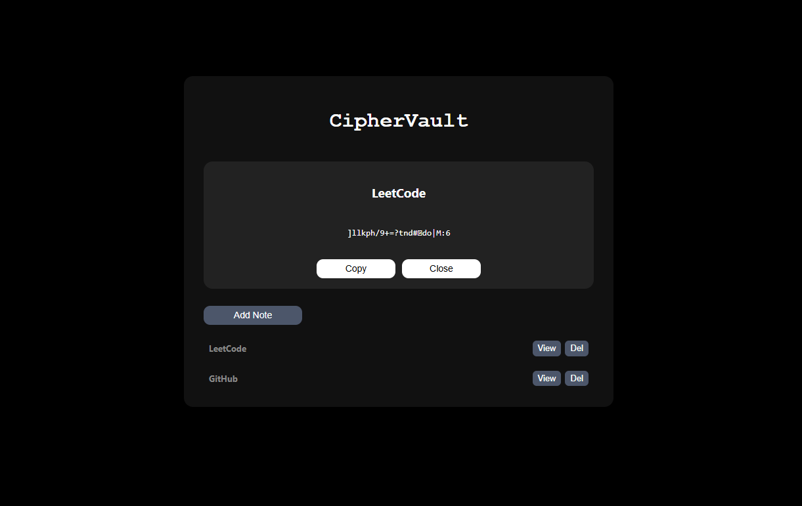
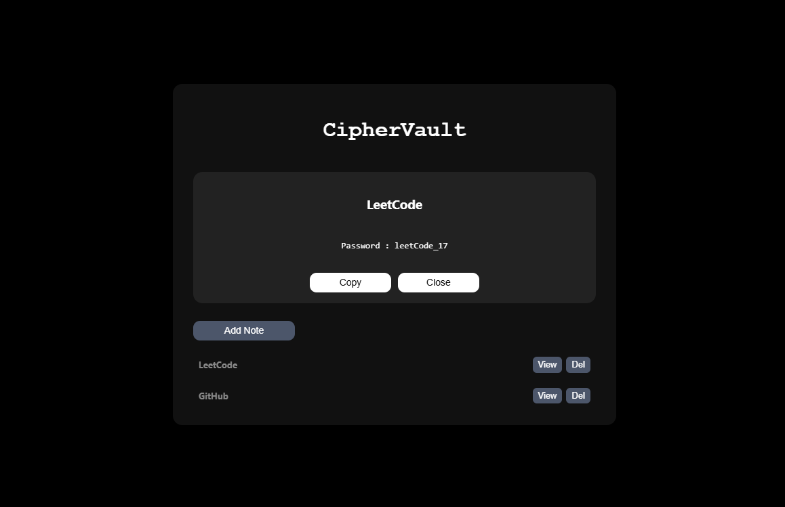

# CipherVault (Project 27/30)

CipherVault is a browser-based secure note manager. It allows you to save encrypted notes or passwords locally, unlock them with a password, and auto-locks after inactivity.

Features:
- Password protection for unlocking the vault.
- Shows encrypted content when the wrong password is entered
- Reveals real content only when the correct password is entered
- Add, view, and delete encrypted notes.
- Copy note content to clipboard.
- Auto-locks after 2 minutes of inactivity.

Tech Stack: 
HTML | CSS | JavaScript 

How to Use:
- Clone the repository: (https://github.com/gautamsonpitale17/BuildIn30Days)
- Open index.html in your browser.
- Enter your password to unlock the vault (first-time users can set any password).
- Click Add Note to create a new note with title and content.
- Copy note content using the Copy button.
- Vault will automatically lock after 2 minutes of inactivity.

