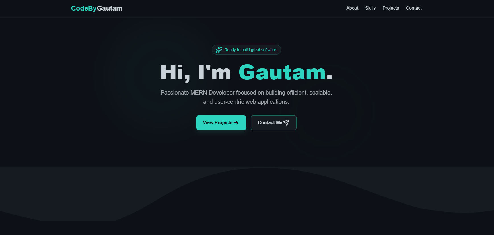

# CodeByGautam (Project 30/30)

CodeByGautam is a personal portfolio, showcasing a 30-day web development challenge. It features a collection of 30 unique frontend projects built with HTML, CSS, and JavaScript, ranging from utility apps to games.

Features:
- Responsive navigation for mobile and desktop screens.
- Smooth transition between the main view and the 30-day projects list.
- Dynamic generation of project cards using JavaScript.
- Direct links to project demos and source code on GitHub.
- Displays project title, description, and link buttons for each project (Day 1 to Day 30).

Tech Stack: 
HTML | CSS | JavaScript 

How to Use:
- Clone the repository: (https://github.com/gautamsonpitale17/BuildIn30Days)
- Open index.html in your browser.
- Navigate the main portfolio page.
- Click on the "30 Days of Code" card to view the list of all 30 projects.
- Use the Demo button to see the live project and the Code button to view the source code.

