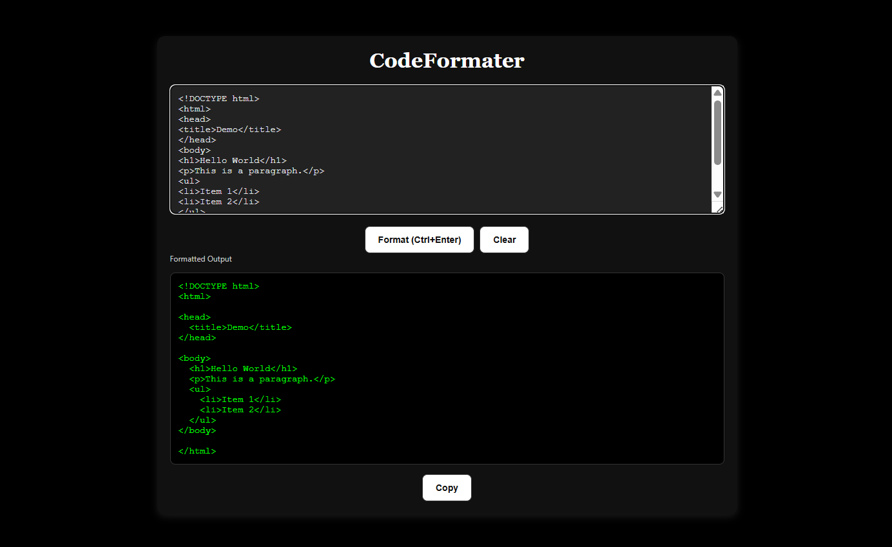

# CodeFormater  (Project 26/30)

CodeFormater is a lightweight, web-based tool that lets you format messy code instantly. 
It supports JavaScript, HTML, CSS, and JSON, making your code readable and well-structured with just a click or a keyboard shortcut.

Features:
- Automatically detect code type: JavaScript, HTML, CSS, JSON.
- Format messy code instantly.
- Copy formatted code to clipboard with one click.
- Supports Ctrl+Enter / Cmd+Enter shortcut for quick formatting.

Tech Stack: 
HTML | CSS | JavaScript 

How to Use:
- Clone the repository: (https://github.com/gautamsonpitale17/BuildIn30Days)
- Open index.html in your browser.
- Paste or write your messy code in the input textarea.
- Click Format (or press Ctrl+Enter / Cmd+Enter) to see formatted output.
- Copy the formatted code using the Copy button.
- Use Clear to reset input and output fields.

