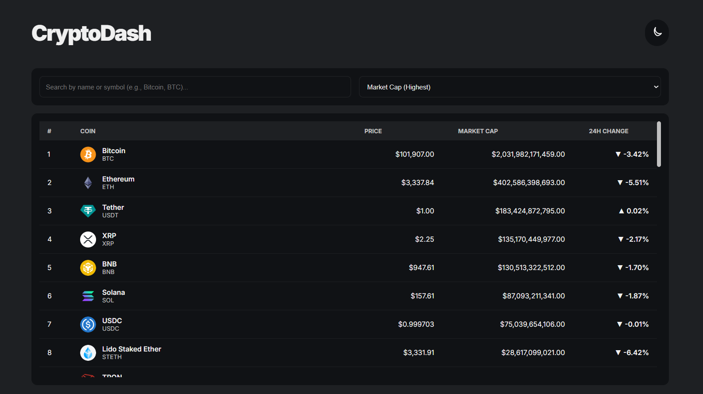
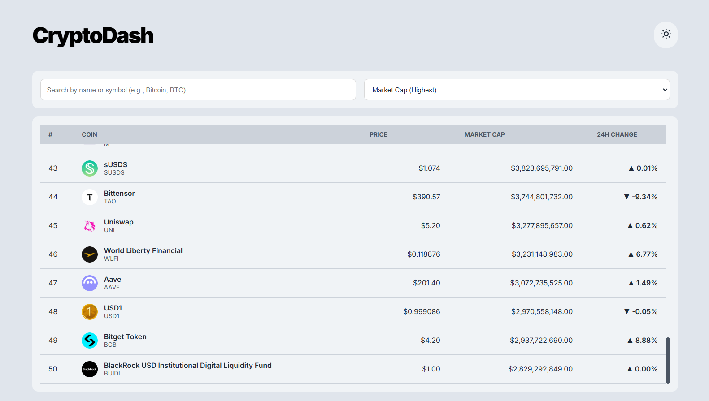

CryptoDash  (Project 17/30)

CryptoDash is a fully responsive web app that displays live cryptocurrency market data with sorting, searching, and dark-light theme toggle features.  

Features:
- Real-time crypto price tracking (via CoinGecko API)
- Search by name 
- Sort by market cap, price, or 24-hour change
- Dark/Light theme toggle with local storage memory

Tech Stack: 
HTML | CSS | JavaScript | CoinGecko API 

How to Use:
- Clone the repository: (https://github.com/gautamsonpitale17/BuildIn30Days)
- Open index.html in your browser.
- Search coins instantly  
- Sort coins in multiple ways  

