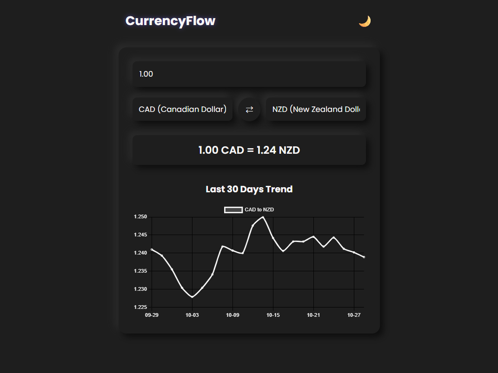
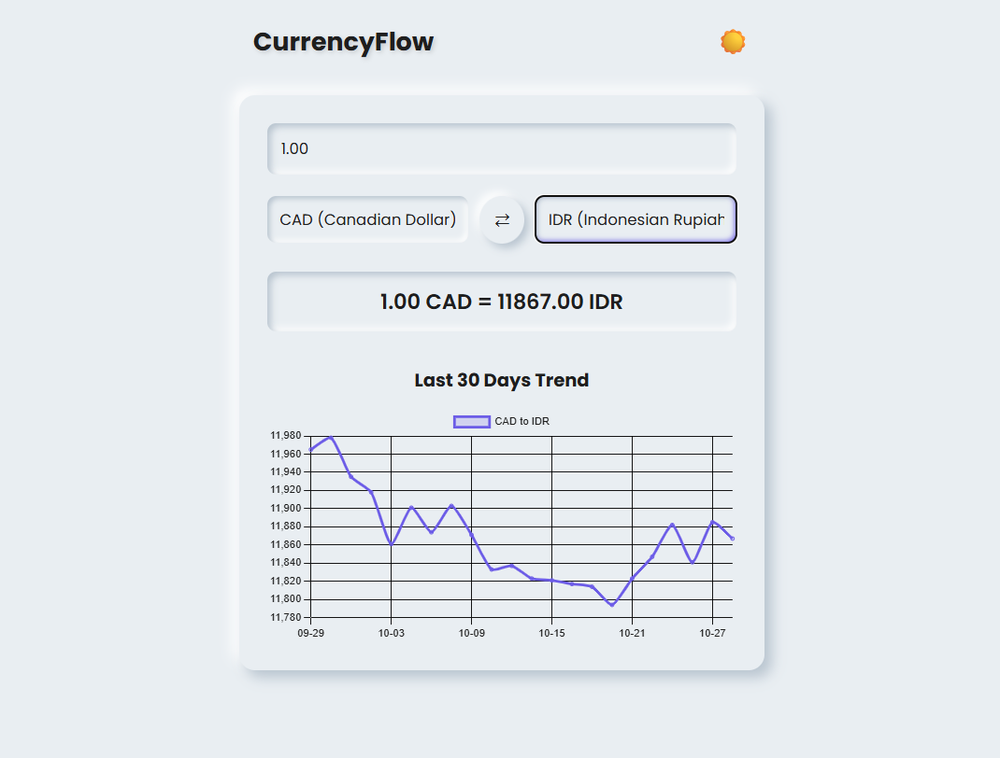

CurrencyFlow (Project 8/30)

CurrencyFlow is a simple currency converter web app that provides real-time exchange rate conversion with a clean and minimal user interface. 
It allows users to convert between major world currencies and visualize historical exchange rate trends.

Features:
- Real-time Currency Conversion.
- 30-Day Exchange Rate Trend Chart powered by Chart.js
- Instant Swap between From and To currencies

Tech Stack: 
HTML | CSS | JavaScript | ExchangeRate.host | Chart.js

How to Use:
- Clone the repository: (https://github.com/gautamsonpitale17/BuildIn30Days)
- Open index.html in your browser.
- Enter an amount and select the currencies you want to convert between.

