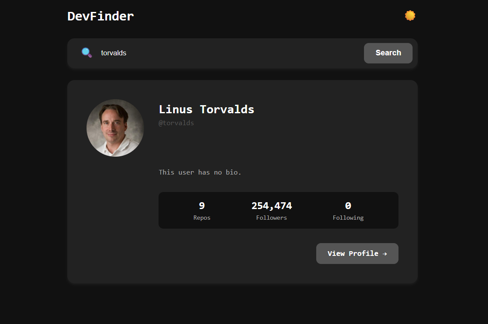

DevFinder (Project 18/30)

DevFinder is a modern, responsive web application that allows you to search for GitHub users and view their profile information instantly.  

Features:
- Search GitHub users by username
- Show public repositories, followers, and following
- Direct link to GitHub profile

Tech Stack: 
HTML | CSS | JavaScript | GitHub API 

How to Use:
- Clone the repository: (https://github.com/gautamsonpitale17/BuildIn30Days)
- Open index.html in your browser.
- Enter a GitHub username in the search input.
- Click Search or press Enter.
- The app fetches user data from the GitHub API, and shows user profile.

