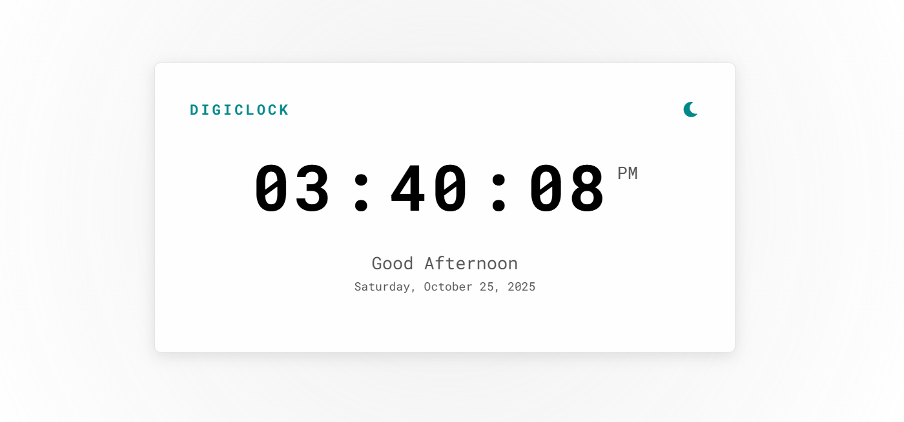
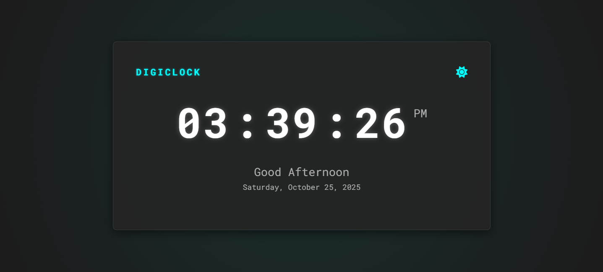

# DigiClock (Project 4/30)

DigiClock is a modern and responsive digital clock.  
It displays real-time hours, minutes, and seconds with a dynamic greeting, current date, and a light/dark theme toggle.

The project combines clean design with smooth animations, making it both functional and visually appealing.

Features :
- Real-time digital clock with smooth updates
- Dynamic greeting message (Morning, Afternoon, Evening)
- Current date display (weekday, month, and year)
- Light and dark theme toggle with localStorage memory

Tech Stack :
HTML | CSS | JavaScript

How to Use :
1. Clone the repository: https://github.com/gautamsonpitale17/BuildIn30Days
2. Open index.html in your browser
3. Enjoy the modern digital time display ⏱️

