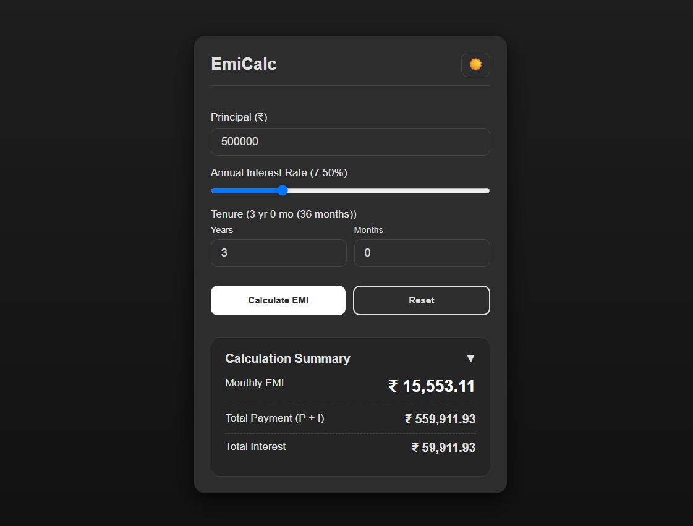

# EmiCalc  (Project 11/30)

EmiCalc is a simple EMI (Equated Monthly Installment) calculator that helps users calculate monthly loan payments, total payable amount, and total interest.  

Features:
- Calculate Monthly EMI instantly  
- Shows Total Payment and Total Interest  
- Adjustable loan amount, interest rate & tenure (years/months)  
- Expandable Calculation Summary section  

Tech Stack: 
HTML | CSS | JavaScript 

How to Use:
- Clone the repository: (https://github.com/gautamsonpitale17/BuildIn30Days)
- Open index.html in your browser.
- Enter the loan amount, annual interest rate, and loan tenure (in months or years).
- Click the Calculate EMI button.
- Use the Reset button to clear fields and start a new calculation.

