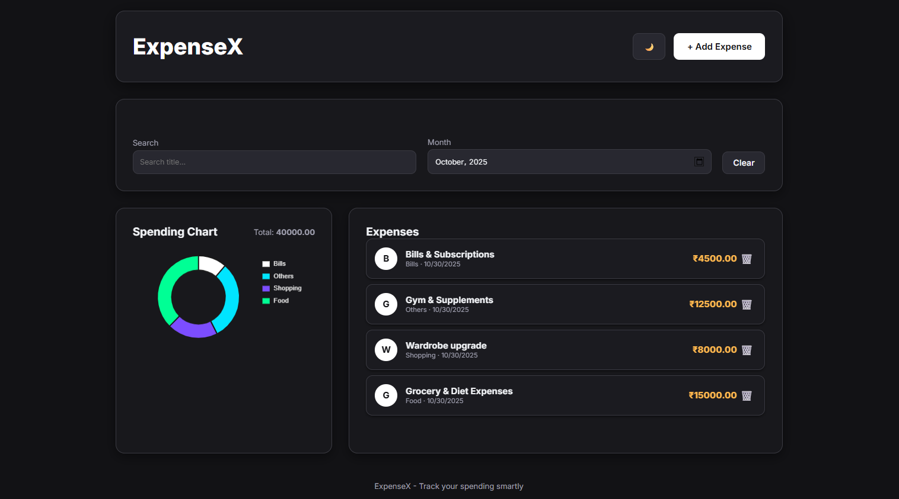
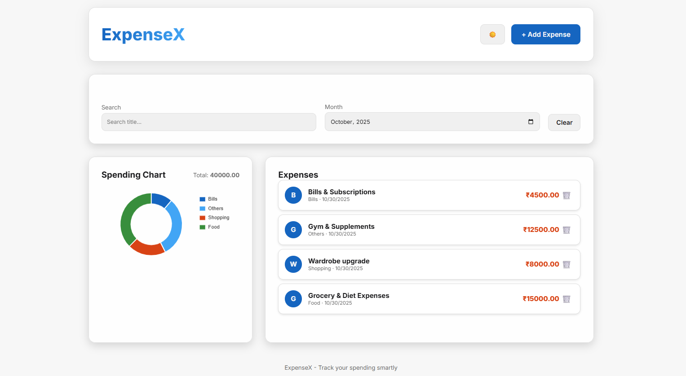

# ExpenseX (Project 9/30)

ExpenseX is a modern and user-friendly personal expense tracker that helps users record, manage, and analyze their daily expenses. 
It allows users to add, edit, and delete expenses, track spending by categories, visualize expenses using charts, and switch between dark and light themes. 
The app saves all data in the browser, ensuring your expense history stays intact even after refreshing or closing the page.

Features:
- Add, edit, and delete expenses
- Categorized expense management
- Interactive charts for spending analysis
- Dark and light mode toggle
- LocalStorage support for data persistence
- Fully responsive design
- Search and filter expenses

Tech Stack: 
HTML | CSS | JavaScript | Chart.js

How to Use:
- Clone the repository: (https://github.com/gautamsonpitale17/BuildIn30Days)
- Open index.html in your browser.
- Add a new expense by entering the amount, category, date, and description.
- View your total expenses and category-wise spending summary.
- Analyze your spending trends with doughnut chart.
- Edit or delete existing expense records when needed.
- Use the dark/light theme toggle for a comfortable viewing experience.
- All your expenses and settings are automatically saved in your browser using LocalStorage.

