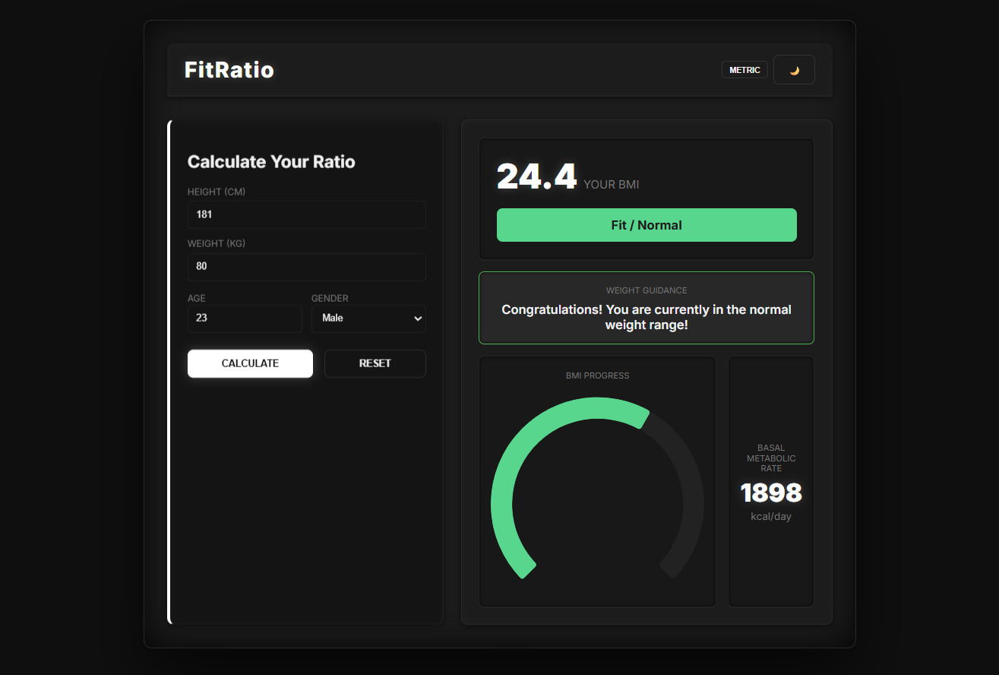
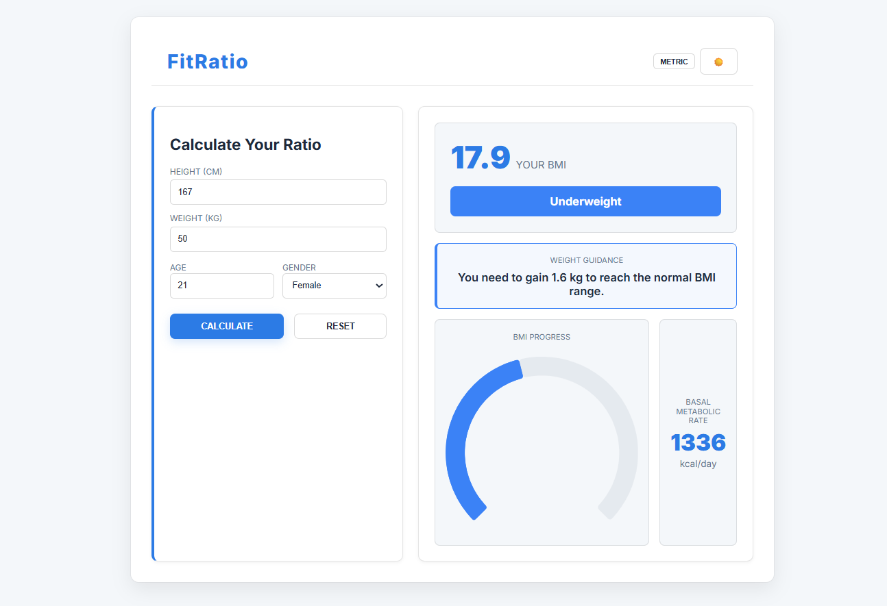

# FitRatio (Project 10/30)

FitRatio is a simple, and user-friendly health calculator that determines the Body Mass Index (BMI) and Basal Metabolic Rate (BMR) based on user inputs. 
It allows users to easily toggle between Metric and Imperial units, view their BMI status with clear guidance, and track their BMI visually with a dynamic chart. 

Features:
- BMI Calculation with health category indicator  
- BMR Calculation 
- Ideal weight suggestion (gain/lose weight guidance)  
- Live interactive BMI Chart (Doughnut UI)  
- Metric ↔️ Imperial Unit Toggle  

Tech Stack: 
HTML | CSS | JavaScript | Chart.js

How to Use:
- Clone the repository: (https://github.com/gautamsonpitale17/BuildIn30Days)
- Open index.html in your browser.
- Enter: Height, Weight, Age, Gender
- Click "Calculate"

