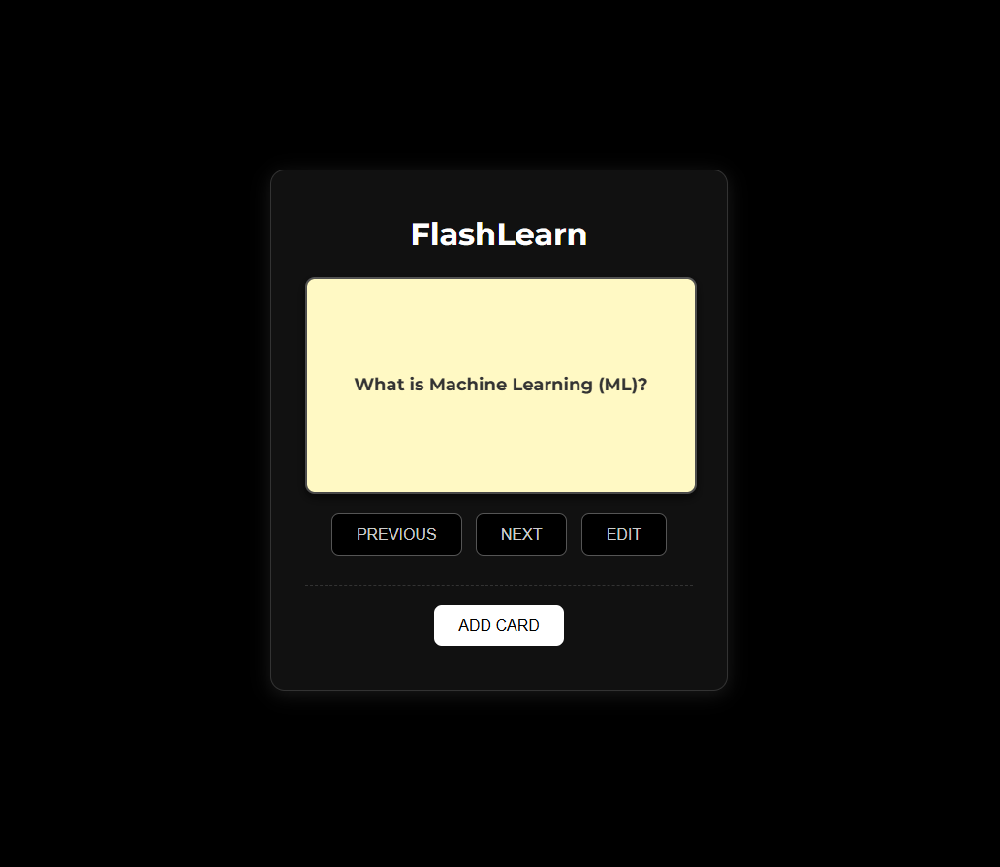
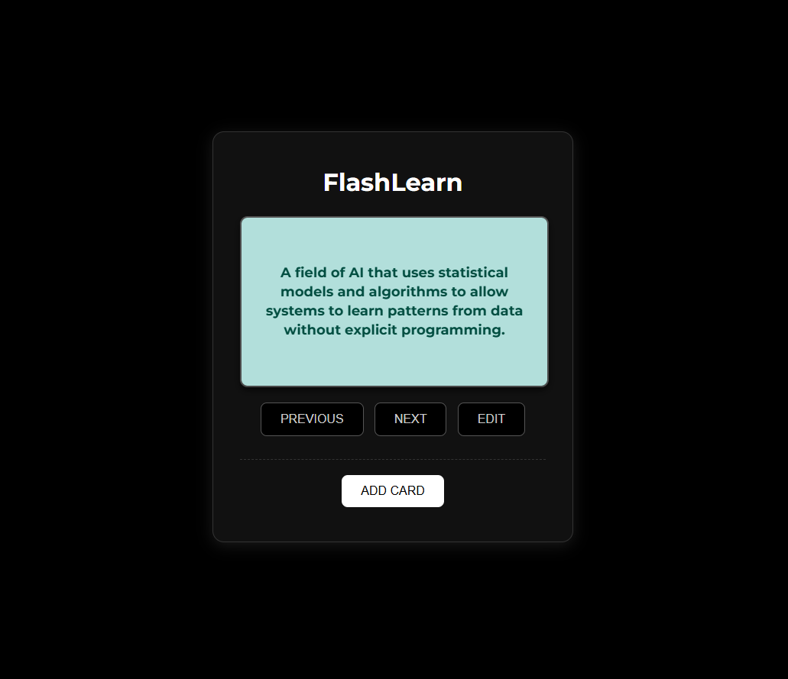

# FlashLearn (Project 29/30)

FlashLearn is a web-based flashcard application that helps you learn and memorize information efficiently. 
You can flip cards to see answers, navigate through cards, and even add your own custom flashcards for personalized learning.

Features:
- View flashcards with questions and answers.
- Flip cards by clicking to reveal answers.
- Navigate between cards using Previous and Next buttons.
- Add custom flashcards with your own questions and answers.
- Flashcards are saved in the browser using localStorage, so they persist across sessions.

Tech Stack: 
HTML | CSS | JavaScript 

How to Use:
- Clone the repository: (https://github.com/gautamsonpitale17/BuildIn30Days)
- Open index.html in your browser.
- Click the flashcard to flip and see the answer.
- Use Previous and Next buttons to navigate between flashcards.
- Click Card to add a new question and answer to your collection.
- Your added flashcards will be saved locally in the browser.

