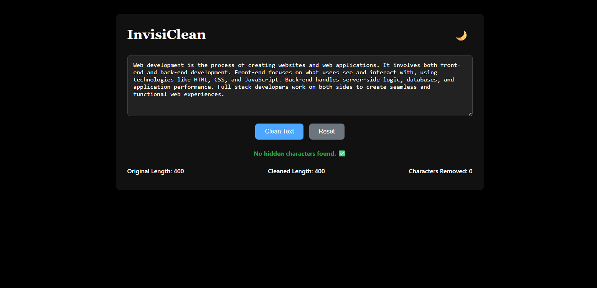
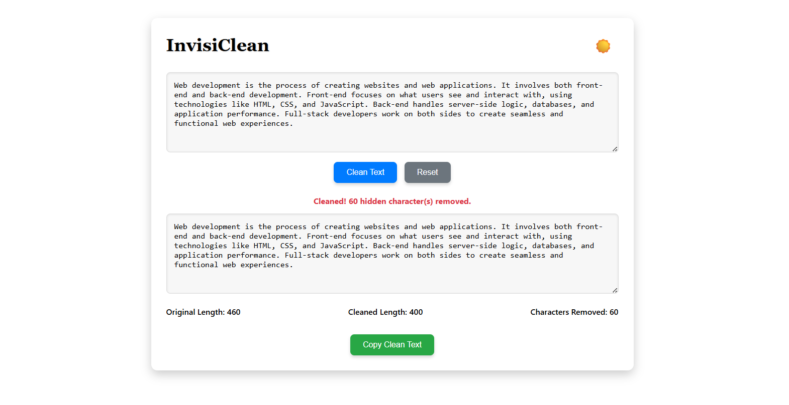

# InvisiClean  (Project 25/30)

InvisiClean is a simple web app that helps you remove hidden or invisible Unicode characters from text or code. It’s perfect for cleaning copy-pasted code, text from PDFs, or documents that may contain invisible characters that can cause issues.

Features:
- Detects and removes hidden Unicode characters like:
  - Zero-width spaces, non-breaking spaces
  - Control characters
  - Invisible formatting characters
- Live cleaning as you type
- Shows stats:
  - Original text length
  - Cleaned text length
  - Number of characters removed
- Copy cleaned text with a single click
- Reset functionality for quick reuse

Tech Stack: 
HTML | CSS | JavaScript 

How to Use:
- Clone the repository: (https://github.com/gautamsonpitale17/BuildIn30Days)
- Open index.html in your browser.
- Paste your text or code in the Input textarea.
- The app automatically detects hidden characters and displays cleaned text.
- Click Clean Text to manually remove hidden characters.
- Click Copy Clean Text to copy the cleaned version to your clipboard.
- Use Reset to clear all fields.

