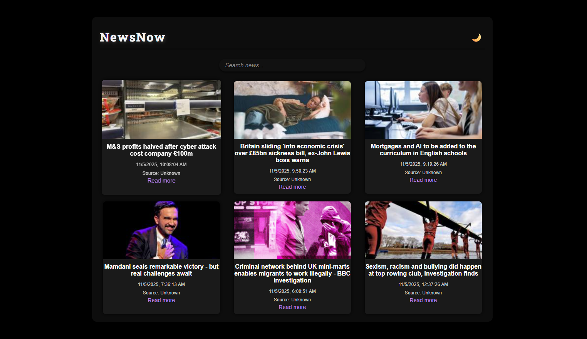
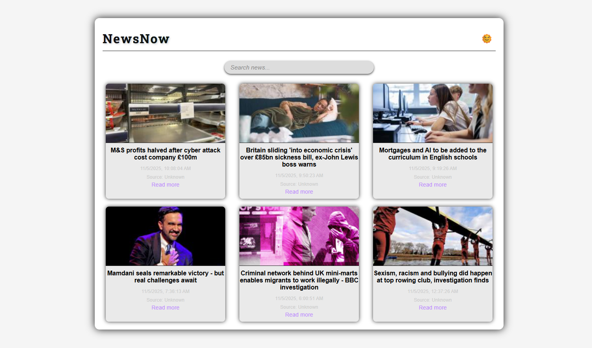

# NewsNow (Project 20/30)

NewsNow is a live news dashboard that aggregates top headlines from multiple trusted sources and displays them in a clean, user-friendly interface. 
Users can search for news articles, view them by date, and open full articles in a new tab. 

Features:
- Live news updates from multiple RSS feeds
- Search functionality to filter news by keywords
- Display latest news with thumbnail, title, and publication date
- Open full news articles in a new tab

Tech Stack: 
HTML | CSS | JavaScript | RSS Feeds | RSS2JSON API

How to Use:
- Clone the repository: (https://github.com/gautamsonpitale17/BuildIn30Days)
- Open index.html in your browser.
- View the latest news aggregated from BBC, CNN, and Reuters.
- Use the search bar to filter news articles by keywords.
- Click on "Read more" to open the full article in a new tab.

