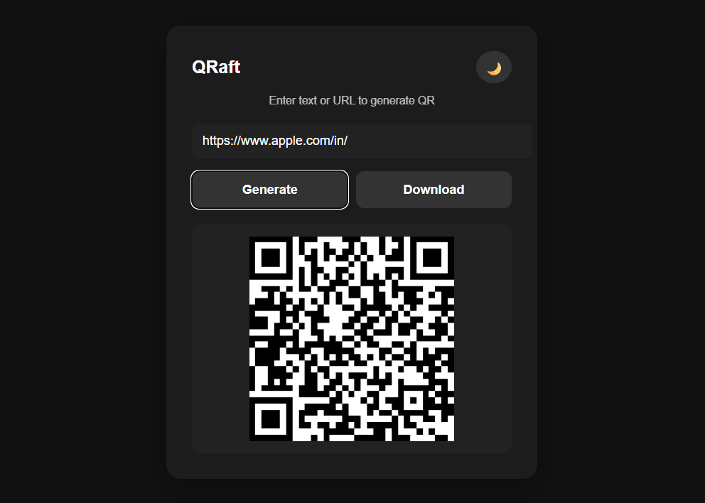
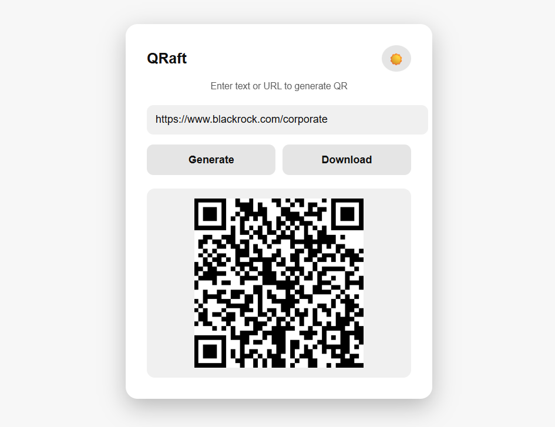

# QRaft (Project 13/30)

QRaft is a modern and minimal QR Code Generator web app that allows users to instantly generate QR codes from any text or URL and download them in a single click.  
With a clean UI, dark/light theme mode, and smooth experience, QRaft makes sharing links and information effortless.

Features:
- Generate QR code from text or URL
- One-click QR download
- Dark & Light theme toggle 
- Responsive and minimal UI

Tech Stack: 
HTML | CSS | JavaScript 

How to Use:
- Clone the repository: (https://github.com/gautamsonpitale17/BuildIn30Days)
- Open index.html in your browser.
- Enter any text or URL in the input field
- Click Generate to create QR code
- Click Download to save the QR code as an image
- Use button to toggle theme

