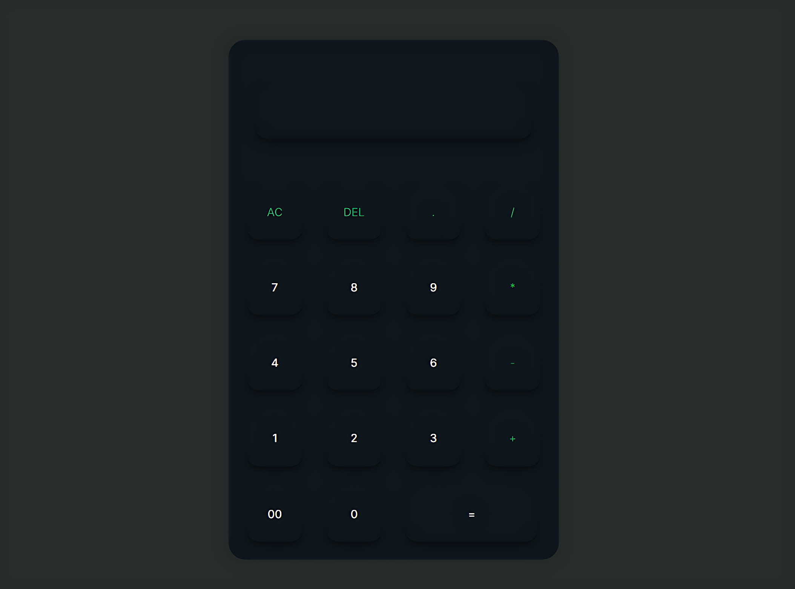

# QuickCalc (Project 1/30)

This is my first project in my 30-day coding, building one small project per day to improve my web development skills.

QuickCalc is a simple calculator built with HTML, CSS, and JavaScript. It performs basic arithmetic operations with a clean and responsive UI.

Features:
- Addition, subtraction, multiplication, and division
- Clear (AC) and Delete (DEL) buttons
- Decimal numbers
- Keyboard support for numbers and operators
- Responsive and visually appealing design

Tech Stack:
HTML | CSS | JavaScript

How to Use:
1. Clone the repository: `git clone https://github.com/gautamsonpitale17/BuildIn30Days`  
2. Open `index.html` in your browser  
3. Start calculating! 🧮

Every big journey starts with small steps, this is my first one 🚀.
