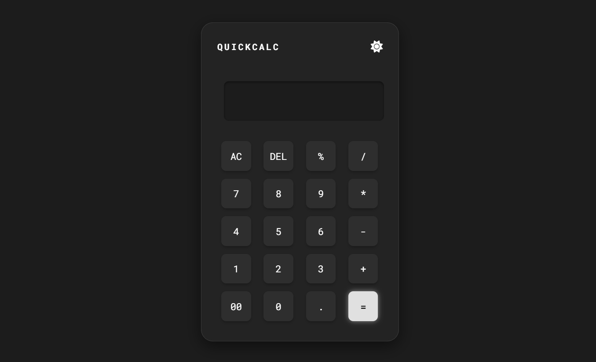
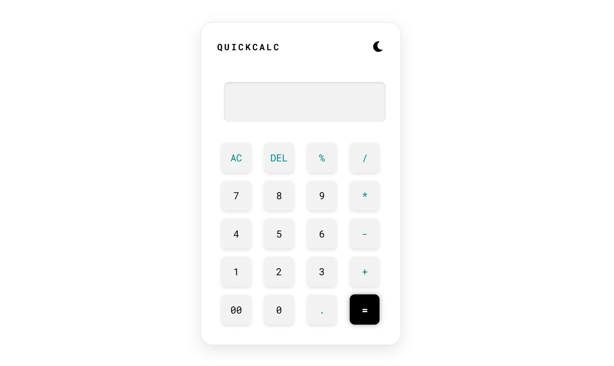

# QuickCalc (Project 1/30)

This is my first project of my #LearnByDoing 30-Days, building one small project per day to improve my web development skills.

QuickCalc is a simple calculator that performs basic arithmetic operations with a clean and responsive UI.

Features:
- Addition, subtraction, multiplication, and division
- Clear (AC) and Delete (DEL) buttons
- Decimal numbers
- Keyboard support for numbers and operators

Tech Stack:
HTML | CSS | JavaScript

How to Use:
1. Clone the repository: (https://github.com/gautamsonpitale17/BuildIn30Days)
2. Open index.html in your browser  
3. Start calculating! 

Every big journey starts with small steps, this is my first one 🚀.
