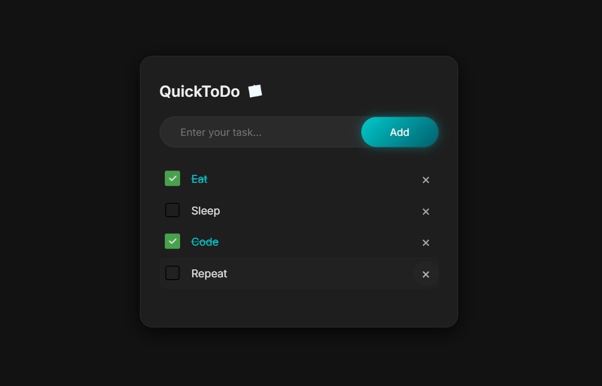

# QuickToDo (Project 2/30)

This is a simple to-do list that,allows you to add, check, and delete tasks with keyboard support.

Features:
- Add new tasks quickly
- Mark tasks as completed
- Delete individual tasks
- Keyboard support:
- Tasks are saved in localStorage

Tech Stack:
HTML | CSS | JavaScript

How to Use:
1. Clone the repository: https://github.com/gautamsonpitale17/BuildIn30Days
2. Open index.html in your browser
3. Start managing your tasks 

