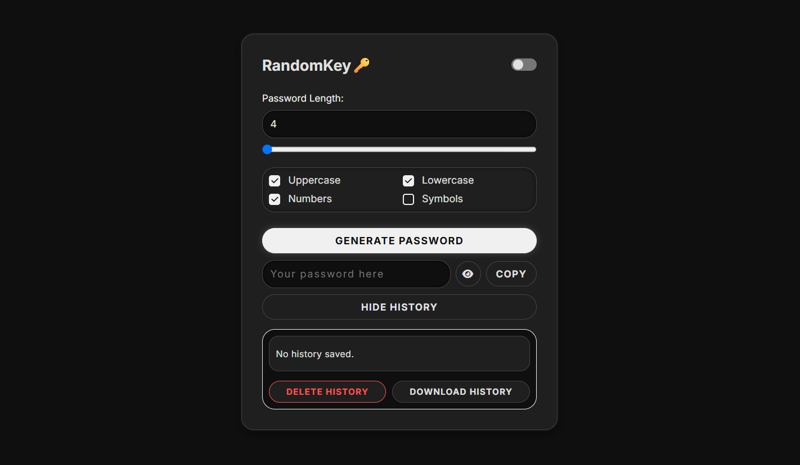
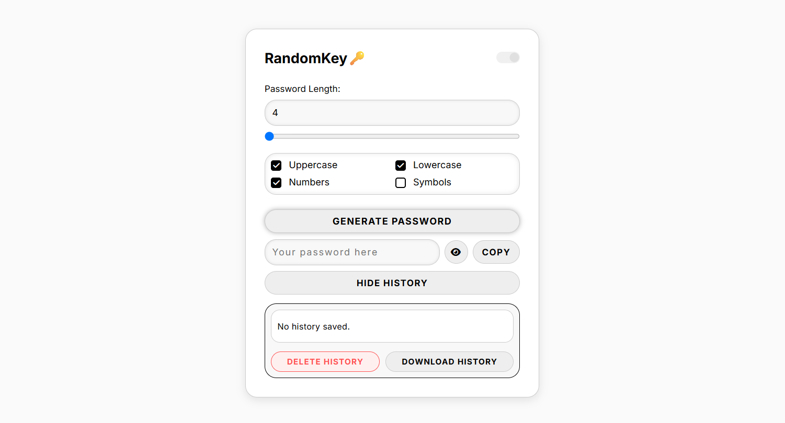

# RandomKey (Project 5/30)

RandomKey is a sleek and modern password generator.  
It allows you to create secure passwords with customizable options and keeps a history of your generated passwords.

Features:
- Generate passwords of custom length (4-32 characters)
- Include uppercase, lowercase, numbers, and symbols
- Copy passwords to clipboard with a single click
- Show/hide password functionality
- Save password history (up to 10 recent passwords)
- Delete or download password history as CSV
- Light/Dark theme toggle
- Responsive design for mobile and desktop

Tech Stack:
HTML | CSS | JavaScript

How to Use:
1. Clone the repository: (https://github.com/gautamsonpitale17/BuildIn30Days)
2. Open `index.html` in your browser  
3. Set your desired password length and character options  
4. Click "Generate Password "
5. Copy, view, or download your password history as needed 🔑

Secure your accounts with strong, memorable passwords!
