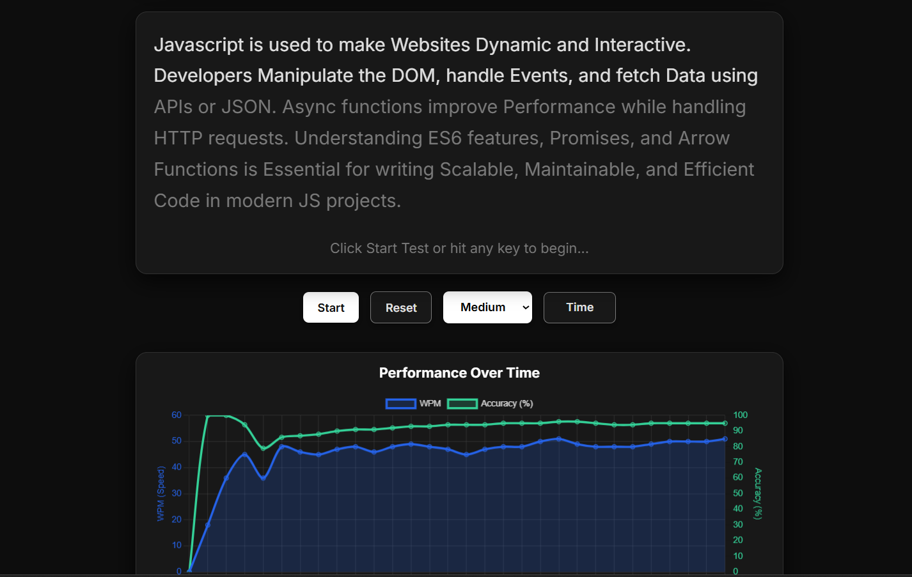

RapidKeys (Project 6/30)

RapidKeys is a modern and responsive typing speed test web app designed to help users improve their typing speed and accuracy in real time.
It features dynamic performance tracking, multiple difficulty levels, and a beautiful, distraction-free interface.

Features:
Real-time WPM (Words Per Minute) and Accuracy Tracking
Displays Errors and Time Left dynamically
Multiple Difficulty Levels (Easy / Medium / Hard)
Adjustable Test Durations (15s, 30s, 60s, 120s)
Interactive Graph to visualize performance over time
Light/Dark Theme Toggle for comfortable viewing

Tech Stack: 
HTML | CSS | JavaScript

How to Use:
Clone the repository: (https://github.com/gautamsonpitale17/BuildIn30Days)
Open index.html in your browser.
Select difficulty level and test duration.
Click “Start” to begin typing.
View your real-time WPM, accuracy, and graph performance updates.
Switch between light/dark modes anytime for a better experience.

