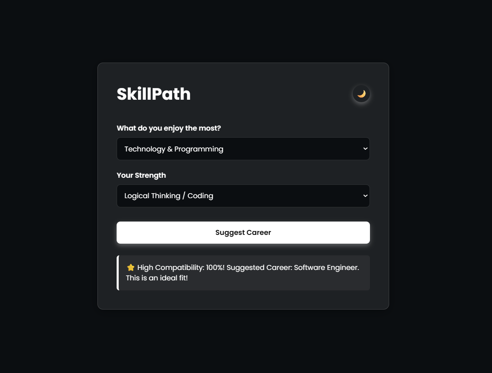
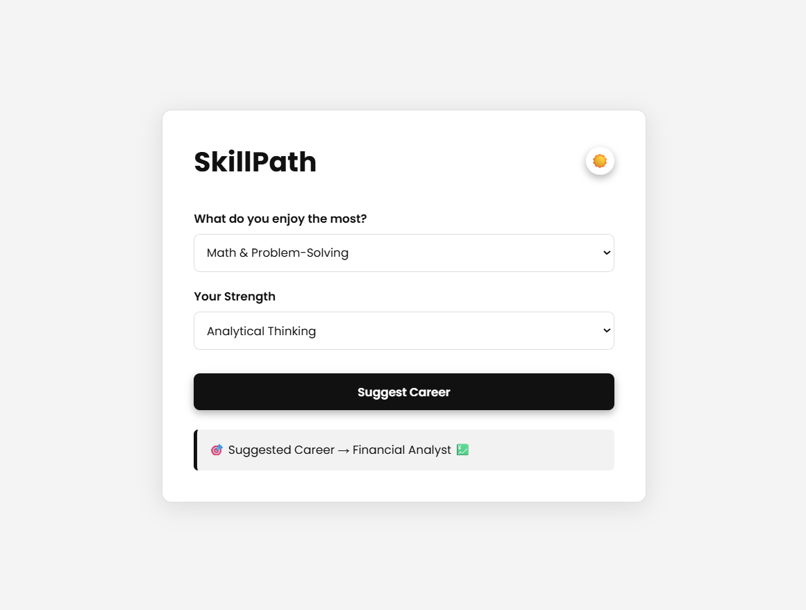

# SkillPath (Project 16/30)

SkillPath is a smart career guidance tool designed to help users find the best-suited career path based on their interests and strengths.  
It uses a simple yet effective logic system to match a user's personality traits with real-world career roles and rates the compatibility.  

Features:
- Smart career recommendation system
- Matches user strengths & interests to a career
- Compatibility score for suggested career
- Light & dark mode toggle
- Fully responsive UI

Tech Stack: 
HTML | CSS | JavaScript 

How to Use:
- Clone the repository: (https://github.com/gautamsonpitale17/BuildIn30Days)
- Open index.html in your browser.
- Select your "interest"
- Select your "strength"
- Click the Suggest "Career button"
- View recommended career & match score instantly
- Use theme toggle for dark/light mode

