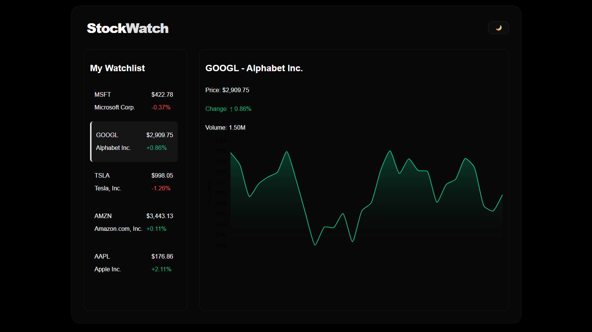
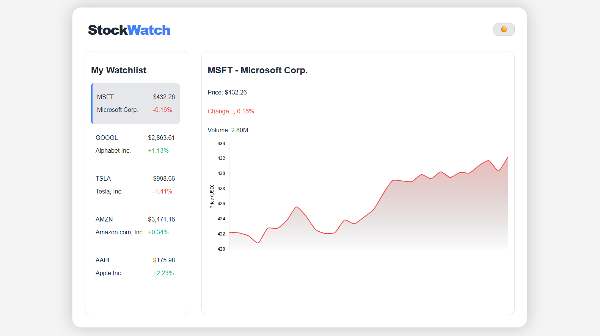

# StockWatch (Project 21/30)

StockWatch is a real-time stock tracking dashboard that allows users to monitor their favorite stocks, view price changes, volume, and visualize price trends over time using interactive charts. 

Features:
- Real-time stock price simulation
- Interactive line charts for price history
- Watchlist for quick access to favorite stocks
- Display of key metrics: price, change %, and volume

Tech Stack: 
HTML | CSS | JavaScript | Chart.js

How to Use:
- Clone the repository: (https://github.com/gautamsonpitale17/BuildIn30Days)
- Open index.html in your browser.
- View the default watchlist with multiple stocks.
- Click on any stock in the watchlist to see detailed metrics and price chart.
- Observe live updates of stock prices and percentage changes every few seconds.

