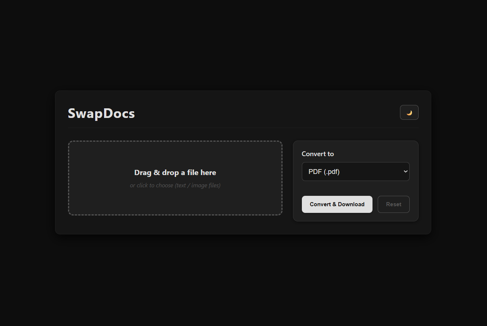
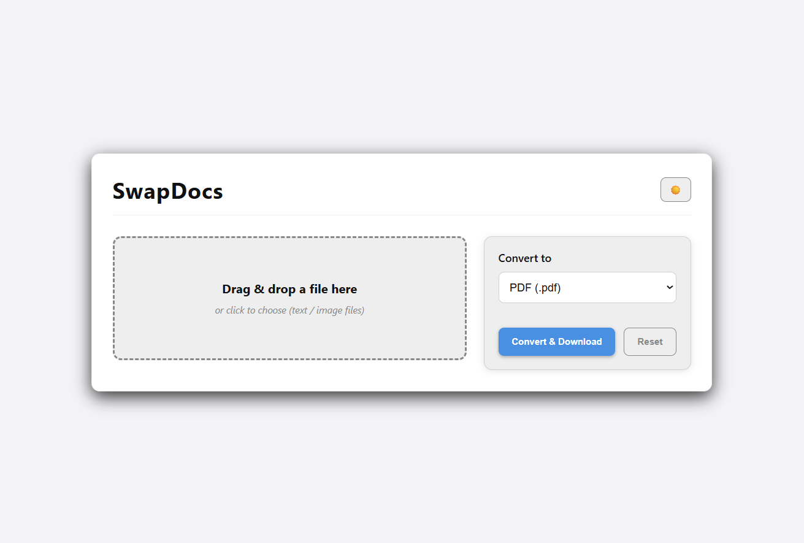

# SwapDocs  (Project 19/30)

SwapDocs is a modern file converter that allows users to easily convert text and image files to PDF, PNG, or JPEG formats. 
With drag-and-drop support and a simple interface, users can upload their files, choose the desired output format, and download the converted files instantly. 

Features:
- Drag & drop file upload
- Convert text files to PDF
- Convert images to PDF, PNG, or JPEG
- Instant download of converted files
- Reset uploaded file functionality

Tech Stack: 
HTML | CSS | JavaScript | jsPDF | PDF.js

How to Use:
- Clone the repository: (https://github.com/gautamsonpitale17/BuildIn30Days)
- Open index.html in your browser.
- Upload a text or image file by dragging it into the dropzone or clicking to select.
- Select the desired output format from the dropdown menu.
- Click "Convert & Download" to download your converted file.
- Use the "Reset" button to clear the uploaded file and start again.

