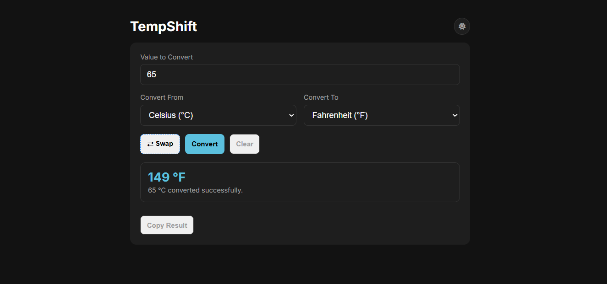
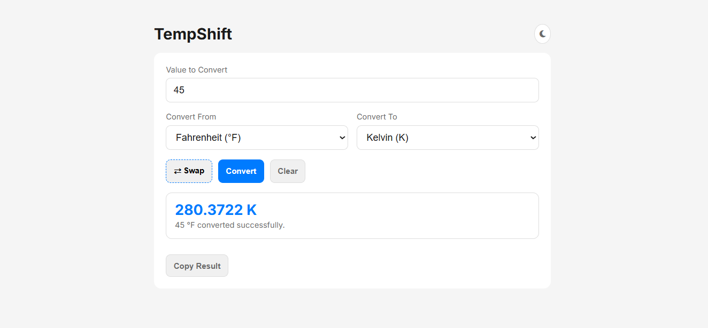

TempShift (Project 12/30)

TempShift is a clean and modern temperature converter web app that converts between Celsius, Fahrenheit, and Kelvin instantly. 
It includes smart features like theme toggle, unit swapping, and clipboard copying for quick usage.

Features :
- Convert Celsius, Fahrenheit, and Kelvin
- Instant real-time conversion
- Swap units with one click
- Copy result to clipboard
- Input validation 
- Light and Dark theme toggle
- Responsive and minimal UI

Tech Stack: 
HTML | CSS | JavaScript

How to Use:
1. Clone the repository: (https://github.com/gautamsonpitale17/BuildIn30Days)
2. Open index.html in your browser.
3. Enter a temperature value and select units
4. Press Convert or hit Enter
5. Swap units to reverse convert instantly
6. Copy results with one click
7. Toggle between dark and light mode anytime

