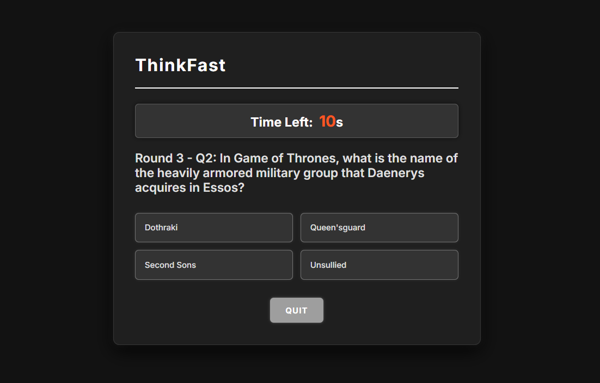

# ThinkFast Quiz (Project 3/30)

This is a fun and interactive quiz game built with HTML, CSS, and JavaScript. It tests your knowledge of popular TV shows with a sleek, modern interface and timed questions.

ThinkFast Quiz delivers a responsive, dark-themed UI with smooth animations and provides immediate feedback for each answer.

Features :
- Randomized quiz questions per round
- Timed questions (15 seconds per question)
- Shows correct and incorrect answers with color indicators
- Multiple rounds with score tracking
- Quit option to end the quiz anytime
- Responsive design for mobile and desktop

Tech Stack :
HTML | CSS | JavaScript

How to Use :
1. Clone the repository:
   `git clone : (https://github.com/gautamsonpitale17/BuildIn30Days)`
2. Open `index.html` in your browser
3. Click "Start Quiz" to begin testing your knowledge!

