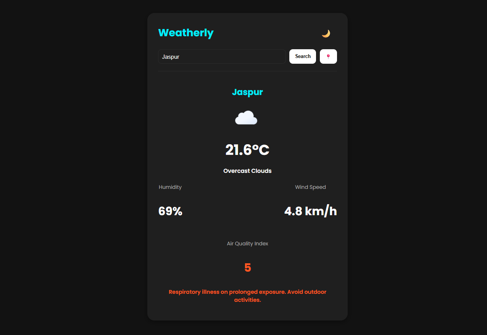

Weatherly (Project 7/30)

Weatherly is a modern, responsive, and elegant weather dashboard web app that provides real-time weather insights and air quality information with a clean and minimal user interface.  
It allows users to check live weather conditions for any city or their current location, all in one smooth experience.

Features:
- Real-time Weather Data (Temperature, Humidity, Wind Speed, and Conditions)  
- Integrated Air Quality Index (AQI) with color-coded health indicators  
- Current Location Detection using Geolocation API  
- Dark/Light Mode toggle
- Fully Responsive Design for Desktop and Mobile  
- Smooth Transitions and Minimal UI for Focused Experience  

Tech Stack: 
HTML | CSS | JavaScript | OpenWeatherMap API

How to Use:
- Clone the repository: (https://github.com/gautamsonpitale17/BuildIn30Days)
- Open index.html in your browser.
- Search for a city name or use the Locate Me button to get your current weather.  
- View temperature, condition, humidity, wind speed, and real-time AQI value.  
- Toggle between light and dark themes for a comfortable viewing experience. 

